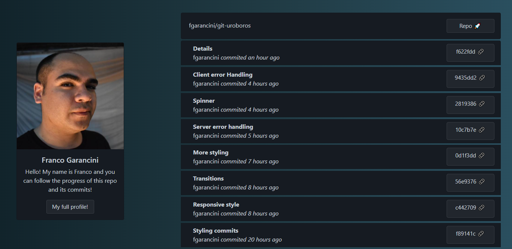

# git-uroboros
See your commit history from github!

Back-end build in node js with Express.

Front-end build in Reactjs and Bootstrap.

# To start

Create a .env file in the Server folder add your GIT_TOKEN, GIT_USER GIT_REPO and set your port. Currently .env.example has my git user and this repo, but no my api key 🤖.

Example

``` bash
GIT_TOKEN=API_KEY
GIT_USER=fgarancini
GIT_REPO=git-uroboros
```

Install dependencies in Server/
``` bash
$ npm install
```
Install dependencies in Client/git-uroboros
``` bash
$ npm install
```

# Start

To start the proyect in Server/

``` bash
$ npm start
```

To start the Client in Client/git-uroboros

``` bash
$ npm start
```

# Server

You can fetch data from the endpoints

``` bash
$ /api/profile
```

``` bash
$ /api/repo
```

``` bash
$ /api/commits
```

# Client


